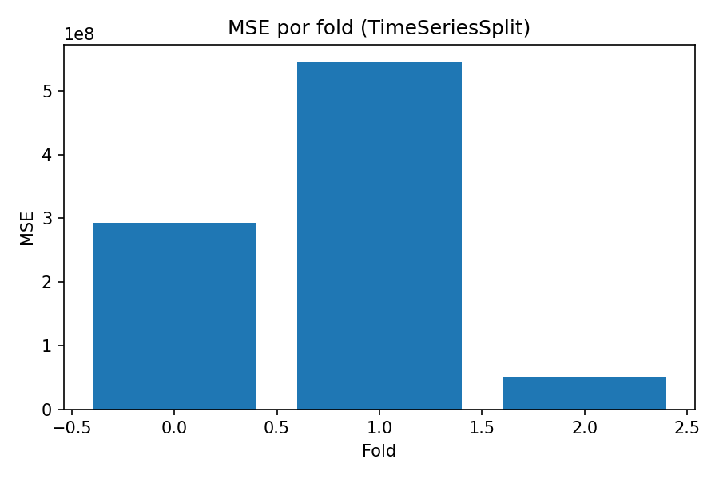

## Experimentos, Evoluções e Resultados

### 1. Linha do Tempo e Iterações
- Integração dos dados e padronização temporal (`month_index`, `sector_int`).
- Construção da grade mês × setor e regra do alvo 0 quando ausente.
- Engenharia de lags e médias móveis para variáveis-chave (1,3,6) e (3,6).
- Pipeline de pré-processamento com imputação e escala; alvo `log1p`.
- Busca de hiperparâmetros do MLP com validação temporal.
- Avaliação em holdout final e cálculo do score de competição customizado.

### 2. Versões do Modelo
- v1: baseline linear/log sem lags — alto erro, subajuste.
- v2: MLP raso (64×2), ReLU, sem MAs — melhora modesta.
- v3: MLP profundo (256-128-64), `tanh`, lags+MAs — melhor OOF MSE.

### 3. Métricas
- OOF MSE: ~7.78e8.
- Holdout score competição: ~0.764; `frac_le1` ≈ 0.94.

### 4. Principais Insights
- Lags e MAs do alvo, preço e área dominam a importância.
- Sinais de vizinhança e usados agregam poder explicativo.
- Transformação `log1p` estabilizou a perda e reduziu sensibilidade a outliers.

### 5. Espaços para Gráficos
- Evolução do OOF MSE por iteração.
- Curva de aprendizado (loss vs época).
- Predito vs Real (holdout).
- Histograma de resíduos.

Insira as figuras:

