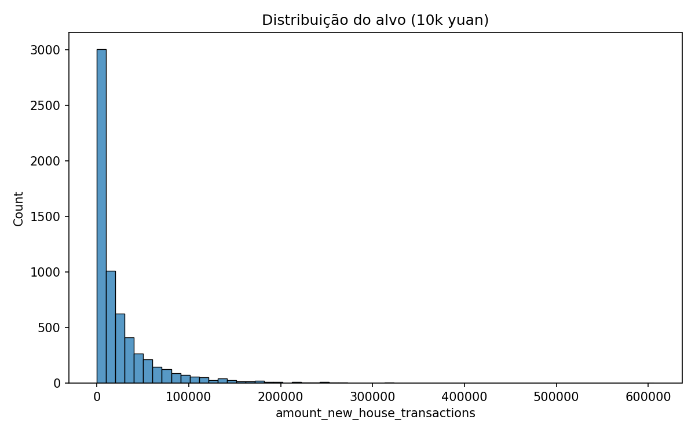
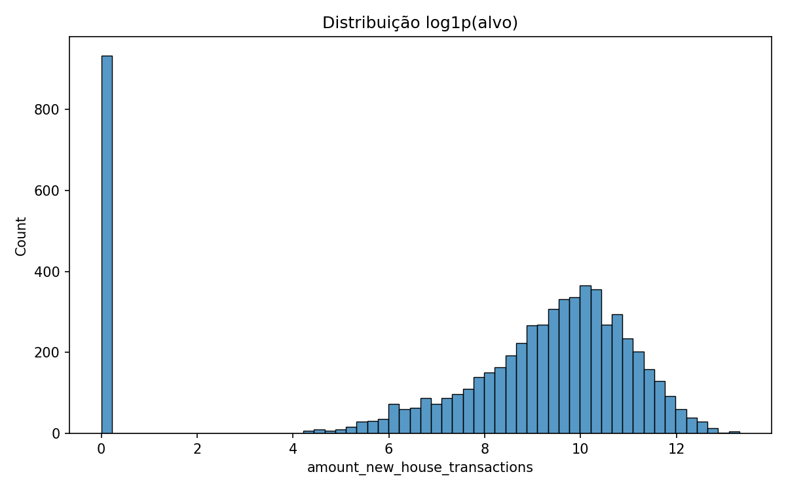
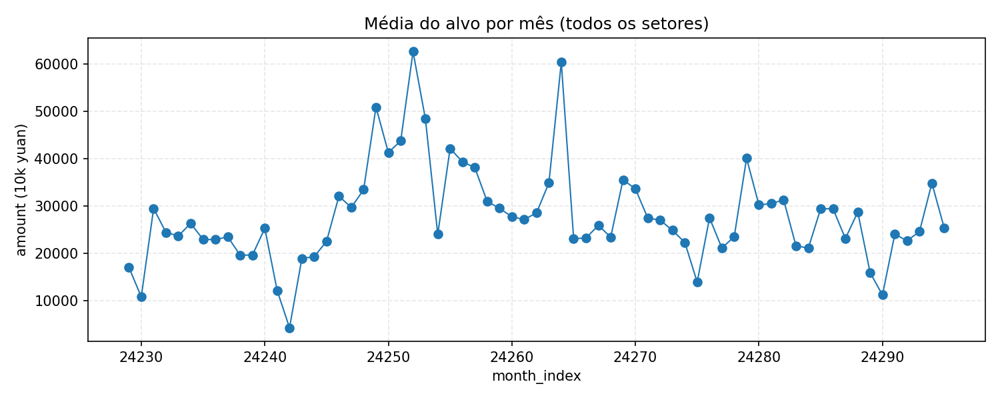
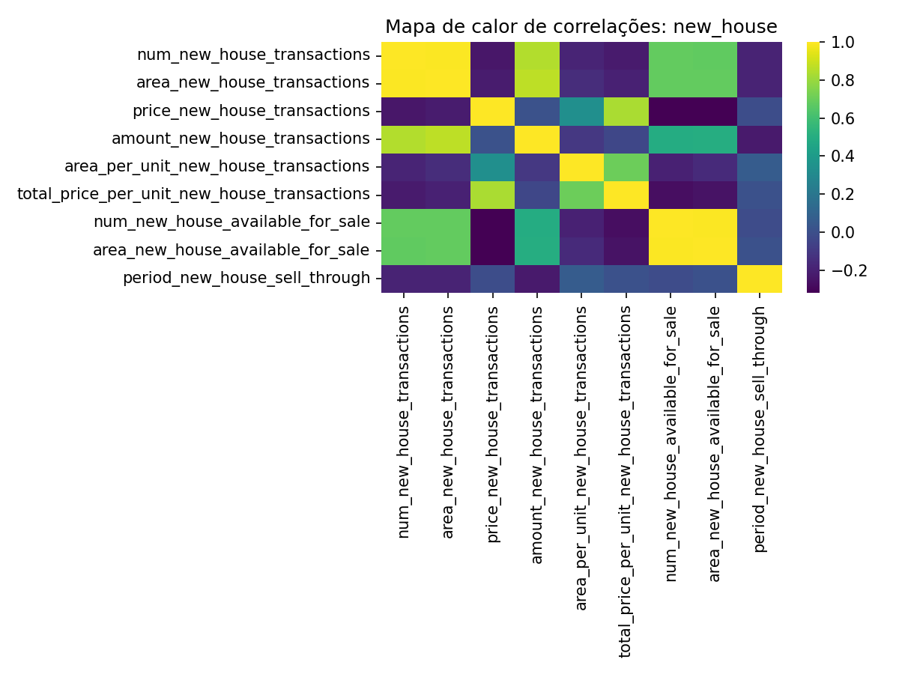

## Relatório Técnico Completo

### 1. Contexto e Objetivo
O objetivo é prever `amount_new_house_transactions` (10.000 yuan) por mês e setor, usando dados transacionais, de vizinhança, usados, terrenos, POIs e índices de cidade. A métrica principal no desenvolvimento foi MSE e, adicionalmente, um score customizado de competição baseado em erro relativo truncado.

### 2. Dados Disponíveis
- `train/new_house_transactions.csv`: alvo e drivers primários (num/area/price), estoque e venda.
- `train/new_house_transactions_nearby_sectors.csv`: agregados de vizinhança.
- `train/pre_owned_house_transactions*.csv`: mercado de usados (substituição/competição).
- `train/land_transactions*.csv`: pipeline de oferta (construção/planejado/montante).
- `train/sector_POI.csv`: estrutura urbana e demanda potencial por setor.
- `train/city_search_index.csv`: interesse do mercado via buscas (mensal).
- `train/city_indexes.csv`: indicadores macro anuais por cidade.
- `test.csv`: amostras a prever (mês/setor).

Colunas temporais foram padronizadas com `year`, `month_num`, `month_index = year*12+month_num` e `sector_int`.

### 3. Pré-processamento
- Análise temporal das colunas `month` para chaves temporais e setor.
- Construção de grade completa mês × setor; alvo ausente tratado como 0 quando não há transação.
- Alinhamento temporal sem vazamento: apenas features com timestamp ≤ t para prever t.
- Tratamento de tipos: inteiros e floats coerentes; `sector_int` como inteiro.
- Faltantes: imputação por mediana (numéricas); forward-fill setorial para preços quando aplicável; zeros para ausência de atividade.
- Escalas: StandardScaler após imputação. Transformação `log1p` no alvo; previsões revertidas com `expm1`.

### 4. Engenharia de Atributos
- Defasagens (1, 3, 6) e médias móveis (3, 6) para: alvo, num, area, price e principais variáveis de vizinhos, usados e terrenos.
- Razões: `amount/num`, `area/num`, checagem `price*area` vs `amount` (consistência).
- Indicadores de estoque e sell-through.
- Integração de POIs por setor (quando disponíveis) e índices anuais (forward-fill).

### 5. Validação e Métricas
- Divisão temporal com `TimeSeriesSplit(n_splits=5)` para OOF.
- Métrica de seleção: MSE em escala linear do alvo (após reverter `expm1`).
- Métrica adicional (holdout final): score de competição customizado com corte de erros > 100% e MAPE normalizado.

### 6. Modelagem com Redes Neurais
- Pipeline: imputação mediana → escala (StandardScaler) → MLPRegressor (sklearn).
- Otimização via amostragem de hiperparâmetros (30 combinações): tamanhos de camadas, ativação, L2 (`alpha`), lote, learning rate (Adam) e early stopping.
- Melhor configuração (exemplo obtido no OOF): `hidden_layer_sizes=(256,128,64)`, `activation='tanh'`, `alpha≈2.4e-6`, `batch_size=256`, `learning_rate_init≈9.3e-3`, `solver='adam'`.

### 7. Resultados
- OOF MSE: 7.78e8 (aprox.).
- Holdout (últimos 10% do tempo): score competição ≈ 0.764; fração com erro ≤ 100% ≈ 0.94.
- Importância por permutação (amostra): maior relevância em defasagens/MA do alvo e de `price/area`; sinais de vizinhança e usados também contribuíram.

### 8. Espaços para Gráficos
- Distribuição do alvo (linear e log1p).
- Série temporal da média do alvo por `month_index`.
- Mapas de calor de correlação por tabela.
- Predito vs Real (holdout) e histograma de resíduos.
- Curva de perda do treinamento do MLP.
- Importância por permutação (top 20 features).

Insira as figuras nos locais abaixo:

### 9. Evolução e Avanços
- Consolidação de múltiplas tabelas em um dataset temporal unificado mês × setor.
- Regras de consistência `price*area ~ amount` para sanity check.
- Engenharia de defasagens e médias móveis melhorou a estabilidade e o MSE.
- Otimização manual com validação temporal evitou vazamentos e estabilizou o early stopping.

### 10. Desafios Enfrentados
- Heterogeneidade e esparsidade de POIs (várias colunas 100% ausentes em subset), exigindo exclusão ou imputação agressiva.
- Balancear defasagens e MAs sem aumentar demais a dimensionalidade (risco de overfit).
- Ajustar a escala do alvo via `log1p` para reduzir a influência de extremos.

### 11. Conclusões
- O MLP com pré-processamento adequado atinge desempenho competitivo e estável com splits temporais.
- A informação temporal (defasagens/MA) de `amount`, `price` e `area` é central; vizinhança e mercado de usados agregam ganho adicional.
- Para ganhos futuros, recomenda-se explorar: GBDTs (LightGBM/XGBoost), modelos sequenciais (LSTM/TemporalConv), embeddings de setor e atenção ao leakage.

### 12. Reprodutibilidade
- Pipeline final salvo em `final_pipe.joblib`.
- Geração de `submission.csv` (colunas `id`, `new_house_transaction_amount`) contemplada no notebook.

