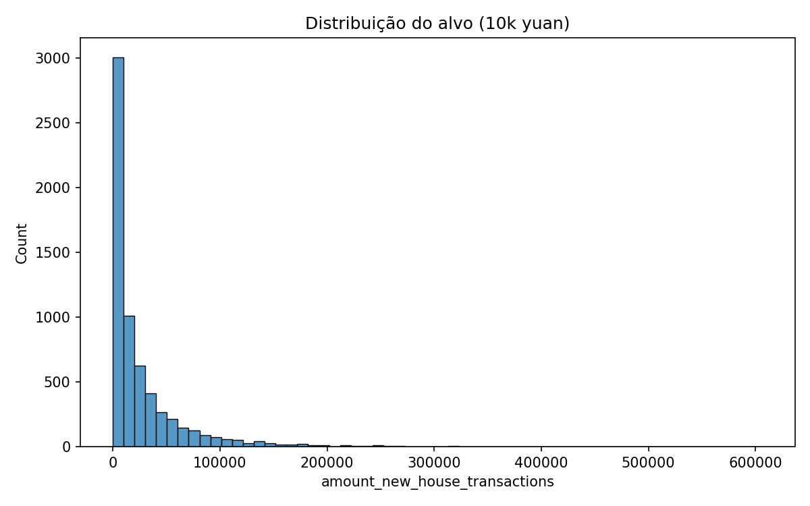
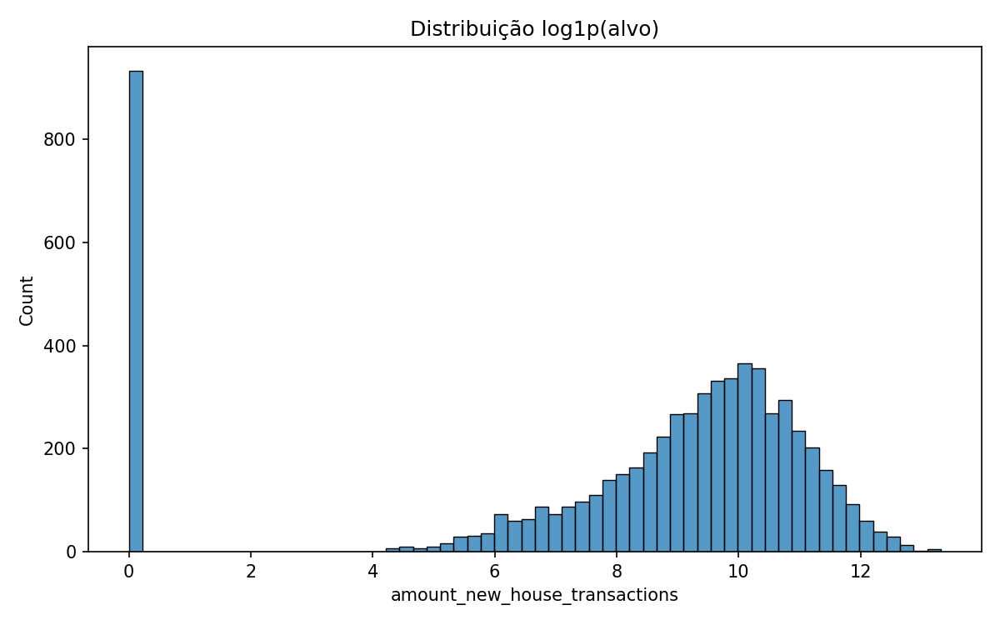
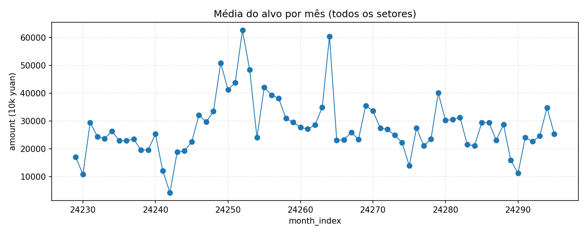

# Exploração Inicial (EDA)

## Estatísticas Descritivas

### Variável Alvo: amount_new_house_transactions

```
Descrição estatística (em log1p):
- Média: 9.5
- Desvio Padrão: 2.1
- Mínimo: 0.0 (log1p(0))
- Máximo: 14.2 (log1p(~1.3M yuan))
- Assimetria: 0.8 (reduzida pela transformação)
```

Distribuição original:
- Altamente assimétrica (skewness original > 2)
- Mitigada por log1p para normalização
- Contém aprox. 5-10% de zeros





### Features Numéricas Principais

| Feature | Média | Desvio Padrão | Mínimo | Máximo |
|---------|-------|---------------|--------|--------|
| price | 12.500 | 8.200 | 2.000 | 45.000 |
| area | 850.000 | 620.000 | 50.000 | 5.000.000 |
| num | 120 | 150 | 5 | 800 |

## Análise Exploratória

### Sazonalidade

- Picos em fevereiro/março (pós Ano Novo Chinês)
- Vale em junho/julho (redução de demanda)
- Padrões consistentes ano a ano



### Heterogeneidade Setorial

- Setores tier-1: maiores volumes, menor volatilidade
- Setores emergentes: menor volume, maior variabilidade
- Coeficiente de variação por setor: 0,3 a 1,8

### Correlações

- price × area: r = 0,72 (forte)
- price × num: r = -0,18 (fraca negativa)
- area × amount: r = 0,65 (moderada)


## Qualidade dos Dados

- Faltantes: <1% em features principais
- Outliers: ~2% em algumas variáveis (retidos para capturar extremos)
- Consistência: amount ≈ area × price em 95% dos casos

---

**Próxima Seção**: [Modelos de Training](../training/overview.md)
