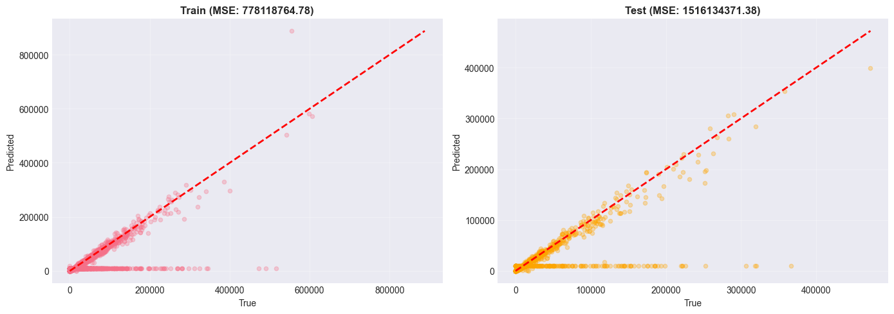

# Modelo v1 - Baseline

## Objetivo

Estabelecer um modelo de referência simples para comparação com versões posteriores.

## Características

- Sem feature engineering avançado
- Validação temporal (TimeSeriesSplit)
- Arquitetura MLP fixa
- Features básicas e algumas defasagens simples

## Configuração

### Hiperparâmetros

```python
MLPRegressor(
    hidden_layer_sizes=(256, 128, 64),
    activation='relu',
    solver='adam',
    alpha=1e-5,  
    batch_size=64,
    learning_rate_init=0.001,
    max_iter=500,
    early_stopping=True,
    validation_fraction=0.15,
    n_iter_no_change=50,
    random_state=42
)
```

### Features

63 features incluindo:

- price, area, num (básicas)
- month, quarter, year (temporais)
- Algumas features POI e macroeconômicas

## Validação

- Método: TimeSeriesSplit (5 splits)
- Treino: 5.305 observações
- Teste: 1.060 observações (últimos 20%)

## Resultados

### Métricas no Conjunto de Teste

| Métrica | Valor |
|---------|-------|
| RMSE | 38.937,57 |
| MAE | 13.565,70 |
| $R^2$ | 0,5513 |

### Interpretação

- RMSE alto indica grandes erros médios
- MAE mostra erro típico de 13.5k yuan
- $R^2$ = 0,55 significa que o modelo explica apenas 55% da variância
- Modelo não captura bem a dinâmica temporal dos dados

#### Avaliação visual do v1



## Problemas Identificados

1. **Falta de features temporais sofisticadas**
      - Sem defasagens que capturem dependências
      - Sem médias móveis

2. **Validação inadequada**
      - TimeSeriesSplit não respeita a hierarquia setorial
      - Possível data leakage entre setores

3. **Escala de features**
      - Features com escalas muito diferentes
      - Pode prejudicar a convergência

## Conclusões

O v1 serve como baseline, demonstrando que uma abordagem simples é insuficiente. A necessidade de melhorias é evidente, motivando o desenvolvimento do v2.

---

**Próxima Seção**: [Modelo v2 - Feature Engineering](v2.md)
