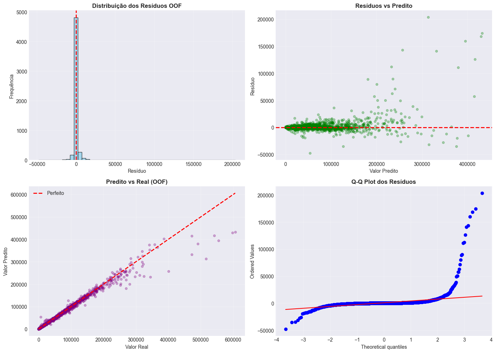
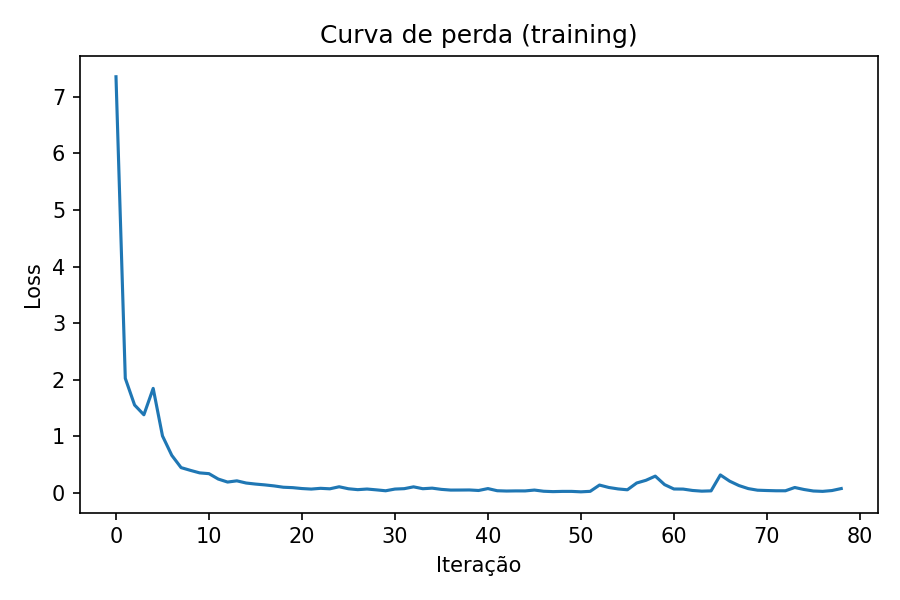
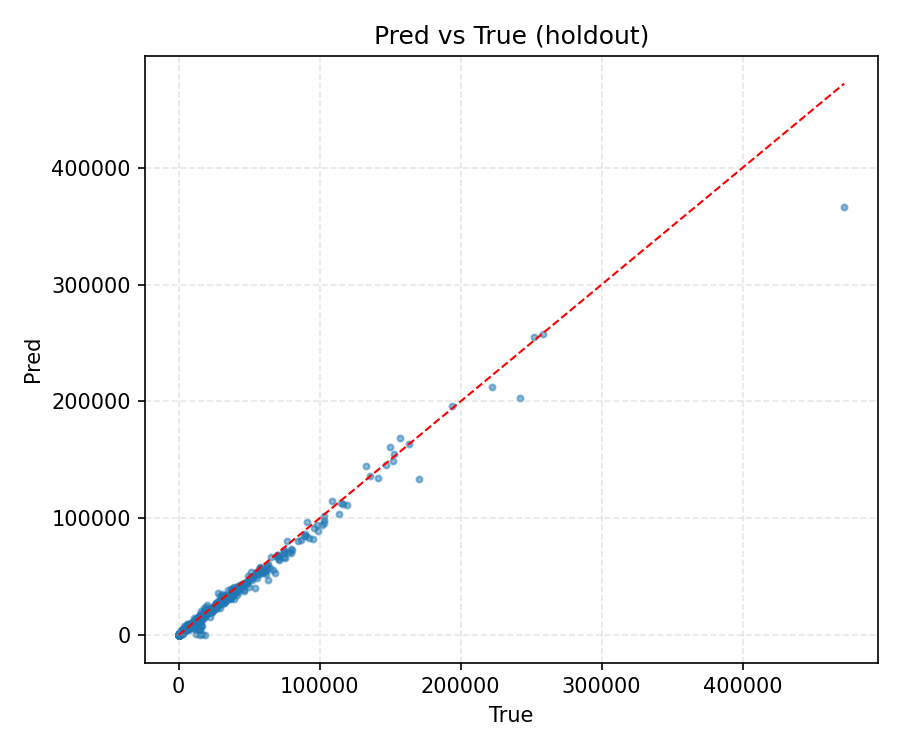
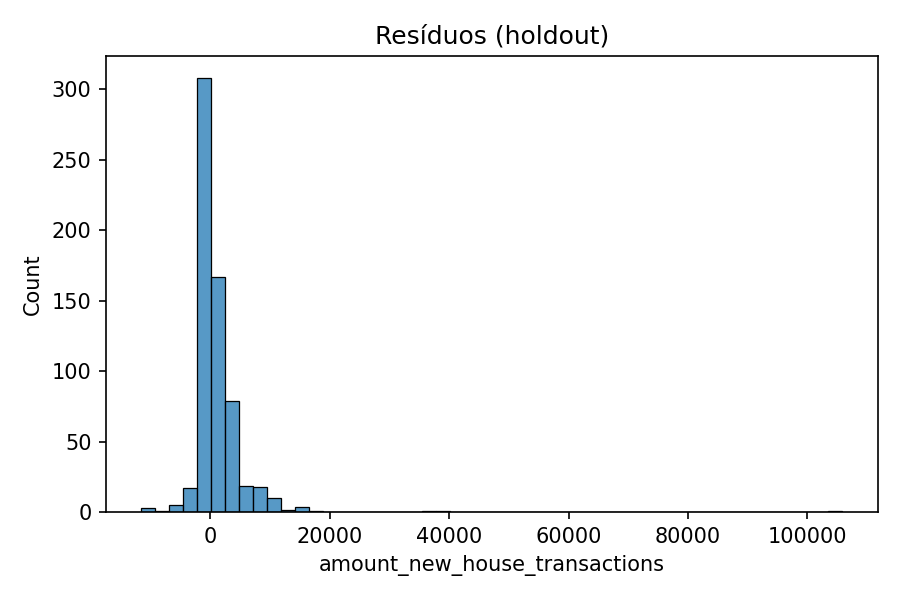
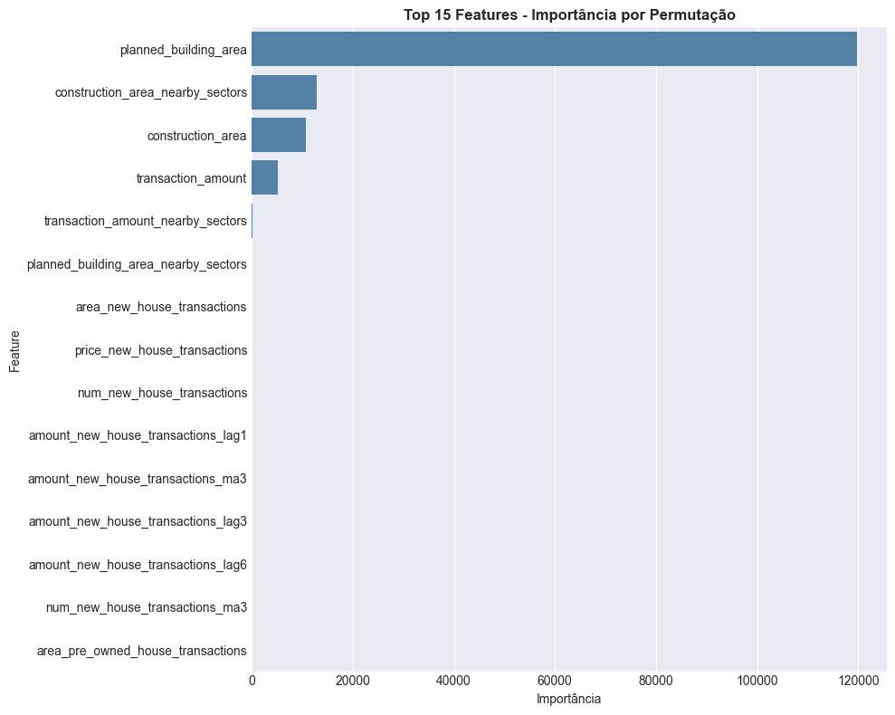
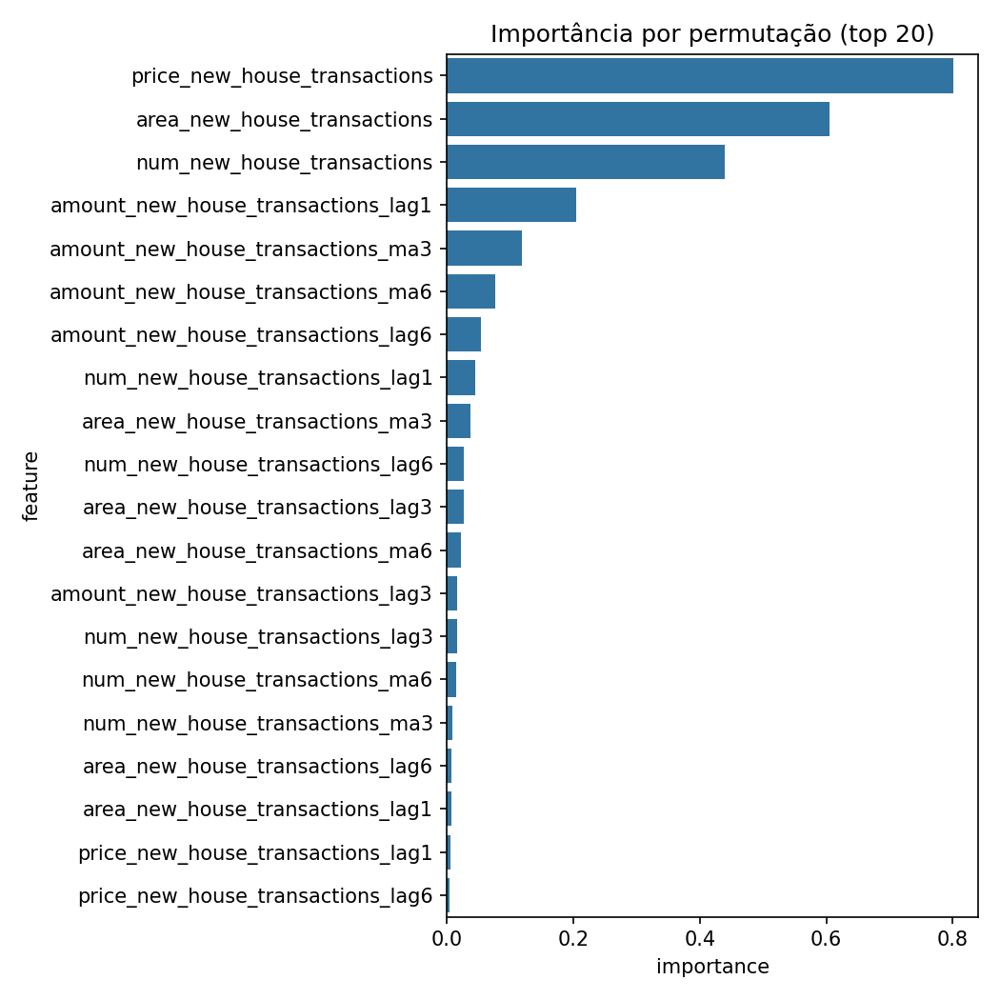

# Modelo v2 - Feature Engineering

## Objetivo

Implementar feature engineering para capturar dinâmica temporal e sazonalidade.

## Mudancas Principais Vs v1

### 1. Feature Engineering Avancado

**Lags (defasagens)**:

- price_lag1, price_lag3, price_lag6
- area_lag1, area_lag3, area_lag6
- num_lag1, num_lag3, num_lag6
- amount_lag1, amount_lag3, amount_lag6

Captura dependencias temporais: padrao atual pode depender de valores 1, 3 ou 6 meses atras.

**Medias Moveis (Rolling Means)**:

- price_ma3, price_ma6 (media de 3 e 6 meses)
- area_ma3, area_ma6
- amount_ma3, amount_ma6

Suaviza ruido e identifica tendencias.

**Interacoes e Ratios**:

- price_x_area: valor total implícito
- price_per_unit: normalizacao por unidade
- area_per_unit: densidade de area

**Features Temporais**:

- month (1-12): captura sazonalidade mensal
- quarter (1-4): captura sazonalidade trimestral
- year: tendencia anual

**Total**: 27 features engineered (reducao de 63 - maior signal/noise)

### 2. Validacao por Setor (GroupKFold)

```python
GroupKFold(n_splits=5, groups=sector_id)
```

- Cada fold contem todos os 95 setores
- Evita data leakage setorial
- Garante que setor no treino nao aparece no teste do mesmo fold
- Mais apropriado para dados hierarquicos

### 3. Ajustes de Hiperparametros

```python
MLPRegressor(
    hidden_layer_sizes=(256, 128, 64),
    activation='tanh',  # V1: relu -> V2: tanh (melhor com dados normalizados)
    solver='adam',
    alpha=1e-5,
    batch_size=256,  # V1: 64 -> V2: 256 (mais estavel)
    learning_rate_init=0.01,  # V1: 0.001 -> V2: 0.01 (convergencia rapida)
    max_iter=500,
    early_stopping=True,
    validation_fraction=0.15,
    n_iter_no_change=20,
    random_state=42
)
```

## Transformacoes Aplicadas

- log1p(target): normaliza distribuicao assimetrica
- StandardScaler: normaliza features
- Forward-fill: imputa dados faltantes em series temporais

## Metricas por Fold

| Fold | RMSE | MAE | R2 | Competition Score |
|------|------|-----|----|--------------------|
| 0 | 2.527,87 | 1.143,52 | 0,9968 | 0,9568 |
| 1 | 2.880,27 | 1.053,08 | 0,9936 | 0,9584 |
| 2 | 7.042,31 | 1.300,78 | 0,9780 | 0,9629 |
| 3 | 5.851,92 | 1.665,47 | 0,9732 | 0,9331 |
| 4 | 13.680,21 | 2.982,59 | 0,9619 | 0,9532 |
| **Media** | **7.547,03** | **1.626,75** | **0,9763** | **0,9530** |

## Diagnosticos

- Resíduos aproximadamente normais (Q-Q plot)
- Preditos vs Reais proximos a diagonal (bom ajuste)
- Consistencia entre folds (variabilidade esperada por setor)

## Melhorias vs v1

| Metrica | v1 | v2 | Melhoria |
|---------|----|----|----------|
| RMSE | 38.937,57 | 7.547,03 | -80,6% |
| MAE | 13.565,70 | 1.626,75 | -88,0% |
| R² | 0,5513 | 0,9763 | +77,0pp |

## Interpretacao

- Reducao massiva do RMSE indica predicoes muito mais acuradas
- R² = 0,97 significa modelo explica 97% da variancia
- Lags e medias moveis capturam padrao sazonal do mercado
- Validacao por setor garante generalizacao regional

## Conclusoes

O v2 demonstra o impacto do feature engineering apropriado. O modelo agora captura adequadamente a dinâmica temporal e a sazonalidade.

### Diagnósticos Visuais Adicionais

#### Avaliação visual do v2 (OOF)



#### Curva de Perda do Treinamento



#### Predito vs. Real



#### Análise de Resíduos



#### Importância das Features (v2)



#### Importância por Permutação (v2)



---

**Próxima Seção**: [Modelo v3 - Otimização](v3.md)
