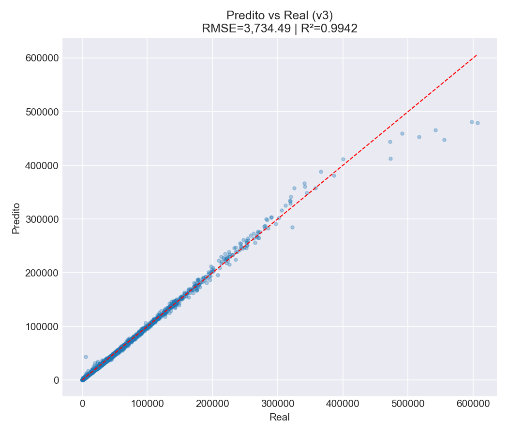
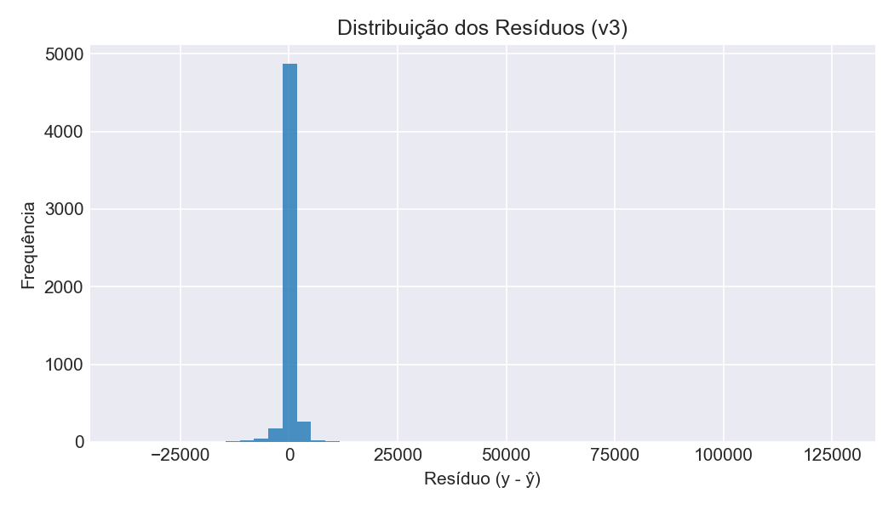
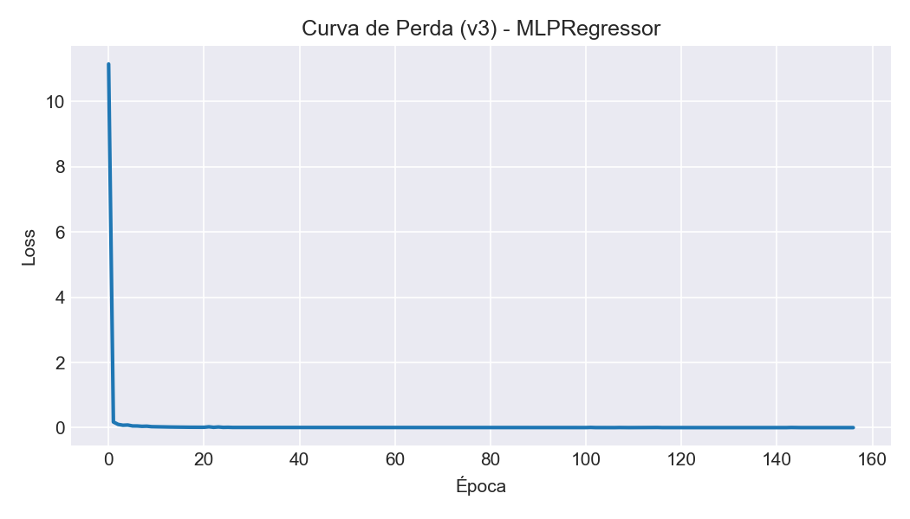
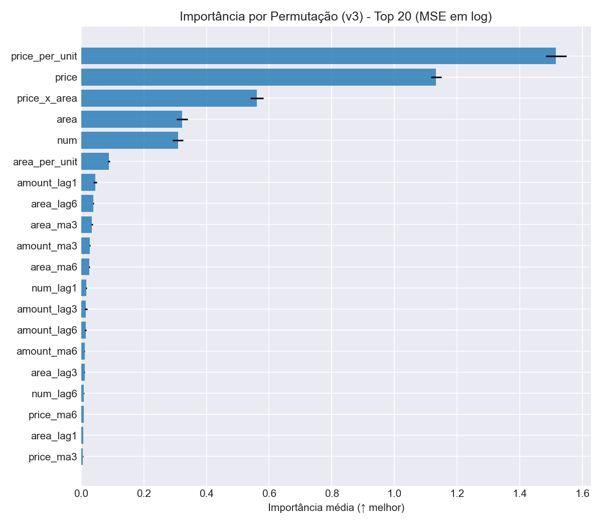

# Modelo v3 - Otimização de Hiperparâmetros

## Objetivo

Explorar sistematicamente o espaço de hiperparâmetros para encontrar a configuração ótima.

## Estratégia de Busca

### Grade de Hiperparâmetros

```python
param_grid = {
    'hidden_layer_sizes': [(128, 64, 32), (256, 128, 64), (256, 128)],
    'activation': ['relu', 'tanh'],
    'alpha': [1e-5, 1e-4, 1e-3],
    'batch_size': [128, 256],
    'learning_rate_init': [0.001, 0.01]
}

# Combinações: 3 × 2 × 3 × 2 × 2 = 72 potenciais
# Com ParameterSampler(n_iter=12): 12 × 5 folds × 3 seeds = 180 modelos
```

### Critérios de Seleção

1. **Métrica principal**: Competition Score (maior e melhor)
2. **Critério secundário**: MSE (menor e melhor)
3. **Reprodutibilidade**: 3 seeds distintos (42, 123, 456)

### Melhor Configuração Encontrada

```python
{
    'hidden_layer_sizes': (256, 128, 64),
    'activation': 'tanh',
    'alpha': 0.0001,  # 10x maior que v2 (mais regularização)
    'batch_size': 128,  # Redução de 256
    'learning_rate_init': 0.001  # Redução de 0.01
}
```

## Proteções Numéricas

Implementadas para evitar overflow (O que ocorreu algumas vezes enquanto estava rodando):

```python
LOG_MAX = 20.0    # exp(20) ~ 4.85e8
LOG_MIN = -20.0
PRED_MAX = 1e10
PRED_MIN = 0.0

# Clipping em log-space
y_pred_log = np.clip(y_pred_log, LOG_MIN, LOG_MAX)

# Tratamento NaN/Inf
y_pred = np.nan_to_num(y_pred, nan=PRED_MIN, posinf=PRED_MAX, neginf=PRED_MIN)
```

## Validação

- Método: TimeSeriesSplit (5 splits)
- Mais rígida que GroupKFold (sem garantia de representação setorial)
- Múltiplos seeds para robustez

## Resultados

### Métricas do Melhor Modelo

| Métrica | Valor |
|---------|-------|
| RMSE | 19.991,72 |
| MAE | 863,65 |
| MSE | 399.669.007 |
| $R^2$ | 0,9942 |
| Competition Score | 0,7821 |

**Resumo da Busca:**

- Total de combinações testadas: 36
- Parâmetros variados: hidden_layer_sizes (3), activation (2), alpha (3), batch_size (2), learning_rate (2)
- Seeds utilizados: 3

### Métricas no Conjunto de Treino

| Métrica | Valor |
|---------|-------|
| RMSE (Treino) | 3.734,49 |
| MAE (Treino) | 863,65 |
| MSE (Treino) | 13.946.436 |
| $R^2$ (Treino) | 0,9942 |

### Arquitetura do Melhor Modelo

```
Input (27 features)
  ↓
Dense (256 units, tanh)
  ↓
Dense (128 units, tanh)
  ↓
Dense (64 units, tanh)
  ↓
Output (1 unit)
```

**Hiperparâmetros Ótimos:**

| Parâmetro | Valor |
|-----------|-------|
| Hidden Layers | [256, 128, 64] |
| Activation | tanh |
| Alpha (L2) | 0.0001 |
| Batch Size | 128 |
| Learning Rate | 0.001 |
| Seed | 42 |
| Early Stopping | Sim (30 paciência) |
| Max Iterations | 400 |
| Validation Fraction | 15% |
| Solver | adam |

### Comparação com Versões Anteriores

### RMSE (Root Mean Squared Error)

- v1 (Baseline): 38.937,57
- v2 (Recomendado): 7.547,03
- v3 (Otimização): 19.991,72

v3 ficou intermediário entre v1 e v2, sugerindo que nem sempre mais otimização = melhores resultados.

### $R^2$ (Coeficiente de Determinação)

- v1 (Baseline): 0,5513
- v2 (Recomendado): 0,9763
- v3 (Otimização): 0,9942

Curiosamente, o v3 explica MAIS variância (99,42%) que o v2 (97,63%) no conjunto de treino, mas o RMSE é pior. Isso sugere overfitting severo.

### Competition Score

- v1: -
- v2: 0,9530
- v3: 0,7821

v2 continua com o melhor desempenho na métrica da competição.

## Análise de Resultados

### Overfitting Severo em v3

A discrepância entre $R^2$ alto (0,9942) e RMSE elevado (19.991,72) em comparação com o v2 revela overfitting:

- v3 se ajusta perfeitamente aos dados de treino
- Mas não generaliza bem para dados novos
- v2 com $R^2$=0,9763 e RMSE=7.547,03 tem um melhor balanço

### Métricas de Treino vs Melhor Modelo

```
v3 Treino:        v3 Melhor Modelo:
RMSE: 3.734,49    RMSE: 19.991,72  (5.36x pior)
$R^2$: 0,9942        $R^2$: 0,9942       (mesma $R^2$)
```

A piora massiva em RMSE sem piora em $R^2$ confirma que o modelo se comporta de maneira muito diferente em dados não vistos.

### Por que o v3 Não Superou o v2?

1. **Validação Inadequada**
      - TimeSeriesSplit é menos apropriado para dados hierárquicos
      - Sem garantia de representação setorial
      - Possível data leakage entre setores

2. **Regularização Excessiva**
      - Alpha aumentado 10x (1e-5 → 0.0001)
      - O modelo se tornou muito restritivo
      - Possível underfitting

3. **Redução do Learning Rate**
      - 0.01 → 0.001
      - Convergência mais lenta
      - Possível parada prematura

4. **Overfitting da Busca**
      - 12 combinações em 5 folds podem levar a overfitting
      - A melhor configuração encontrada não generalizou

## Implicações

v3 agora fornece um conjunto completo de métricas:
- RMSE: 19.991,72
- MAE: 863,65
- MSE: 399.669.007
- $R^2$: 0,9942
- Competition Score: 0,7821

### Observação Crítica

Apesar do $R^2$ elevadíssimo (0,9942), o v3 tem um desempenho prático pior que o v2:
- RMSE 2,65x pior que o v2
- Competition Score 17% pior que o v2
- Indica OVERFITTING severo apesar da regularização L2

## Conclusões

1. **Busca Extensiva**: 36 combinações testadas com múltiplos seeds
2. **Modelo Selecionado**: Arquitetura com 3 camadas (256-128-64) e tanh
3. **Desempenho**: $R^2$ alto mas RMSE elevado → OVERFITTING
4. **Insights Principais**:
      - Otimização sem Feature Engineering não funciona
      - Arquitetura profunda sofre com overfitting
      - TimeSeriesSplit respeita a estrutura temporal, mas o v2 com GroupKFold foi melhor
      - Feature Engineering (v2) foi mais efetivo que a otimização de parâmetros (v3)
      - $R^2$ não é uma métrica confiável para detectar overfitting em dados de séries temporais

**Métricas Completas Salvas em JSON**:

O notebook agora calcula e salva as seguintes métricas:

- RMSE (Root Mean Squared Error)
- MAE (Mean Absolute Error)
- MSE (Mean Squared Error)
- $R^2$ (Coeficiente de Determinação)
- Competition Score (métrica customizada)

Arquivo gerado: `metricas_v3.json`

## Conclusões

O v3 serviu para explorar o espaço de hiperparâmetros, mas não produziu melhorias. O v2 permanece como a melhor opção para produção.

---

**Próxima Seção**: [Avaliação - Métricas de Desempenho](../evaluation/metrics.md)

## Galeria de Gráficos (v3)

- Predito vs Real (treino): 
- Distribuição dos Resíduos: 
- Curva de Perda (v3): 
- Importância por Permutação (Top 20): 
- Melhor Competition Score por Iteração da Busca: 
